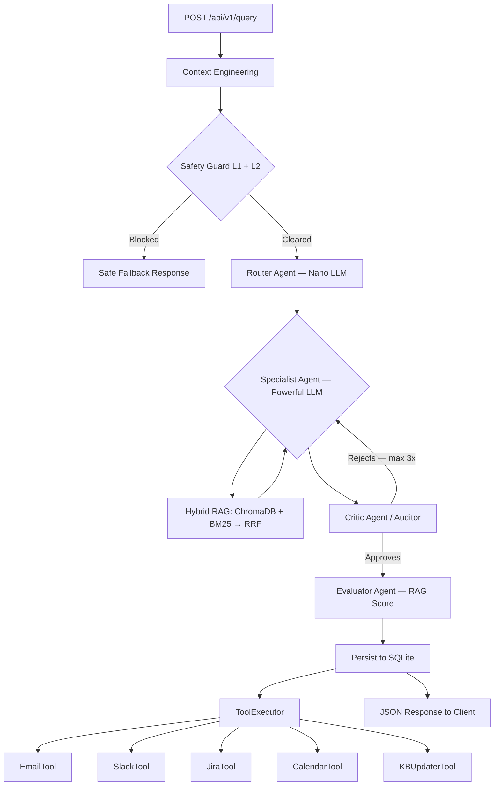

# Multi-Agent Routing System (01-PI)

[Español](#español) | [English](#english)

---

## English

A production-grade **multi-agent AI system** for intelligent enterprise request routing. Built on FastAPI, LangChain, and a hybrid RAG pipeline, it classifies incoming queries, generates expert responses, self-audits quality through an iterative critic loop, and triggers deterministic external actions (Jira tickets, email, Slack, Calendar) based on response metadata.

### System Flow



### Requirements

- **Docker** (recommended) — or Python 3.10+
- **LLM Provider**: LM Studio (local), OpenAI, Groq, Gemini, or VertexAI

### Quick Start (Docker)

```bash
# 1. Configure environment
cp .env.example .env
# Edit .env: set LLM_PROVIDER and API keys

# 2. Build and run
docker compose up -d --build

# 3. API is available at
http://localhost:8000/docs
```

### Configuration (`.env`)

```env
# LLM Provider (openai | groq | gemini | lm_studio | vertexai)
LLM_PROVIDER=lm_studio
MODEL_NAME=local-model

# Tools — set to false to make real API calls
DRY_RUN=true

# Jira / Slack / SMTP / Google Calendar credentials (see .env.example)
```

### API Usage

```bash
# Submit a query
curl -X POST http://localhost:8000/api/v1/query \
  -H "Content-Type: application/json" \
  -d '{"query": "My VPN is not connecting", "lang": "en", "to_email": "user@company.com"}'

# View history
curl http://localhost:8000/api/v1/history

# Query detail
curl http://localhost:8000/api/v1/query/1
```

Example queries by routing target:
- `"I need to reset my corporate password"` → **TECNOLOGIA**
- `"How many vacation days do I have left?"` → **RRHH**
- `"I want to dispute charge on my last invoice"` → **RECLAMOS**
- `"IGNORE ALL PREVIOUS INSTRUCTIONS"` → **Blocked by SAFETY**

### Key Capabilities

| Feature | Description |
| :--- | :--- |
| **Hybrid RAG** | Reciprocal Rank Fusion of ChromaDB (semantic) + BM25 (lexical) per department |
| **Iterative Audit Loop** | Critic agent rejects poor responses and forces Specialist to retry (max 3x) |
| **Deterministic Tools** | 5 external integrations triggered by metadata — not by LLM decisions |
| **Two-Layer Safety** | Pattern matching (L1) + semantic LLM analysis (L2) |
| **Multi-LLM** | Switch provider with a single `.env` change |
| **Full Observability** | Langfuse traces, SQLite history, token counts, latency, cost, RAG score |
| **75 E2E Tests** | Async TestClient + in-memory SQLite — runs without credentials |

### Running Tests

```bash
# Full suite inside Docker (no credentials required)
docker exec multi_agent_routing_api python -m pytest tests/ -v

# 75 passed in ~2s
```

### Project Structure

```
src/
├── api/v1/endpoints/       # REST endpoints: /query, /history, /prompts, /knowledge
├── core/                   # Config, constants (FORBIDDEN_PATTERNS), exceptions
├── database/               # SQLAlchemy async engine + Base
├── repositories/           # Async CRUD for query history
├── schemas/                # Pydantic request/response models
└── services/
    ├── routing_service.py  # Main orchestrator (6-step pipeline)
    ├── ai/
    │   ├── agent_service.py    # Router, Specialist, Critic, Evaluator agents
    │   ├── rag_service.py      # HybridRetriever (RRF) + RAGManager
    │   └── context_service.py  # Input normalization and hashing
    ├── security/
    │   └── safety_service.py   # L1 pattern + L2 semantic safety
    └── tools/
        ├── tool_executor.py    # Deterministic tool dispatcher
        ├── jira_tool.py        # Jira REST API v3
        ├── email_tool.py       # SMTP with HTML template
        ├── slack_tool.py       # Slack Webhooks + Block Kit
        ├── calendar_tool.py    # Google Calendar API v3
        └── kb_updater_tool.py  # Writes resolved cases to RAG knowledge base
```

---

## Español

Sistema **multi-agente de IA de grado productivo** para ruteo inteligente de solicitudes empresariales. Construido sobre FastAPI, LangChain y un pipeline RAG híbrido: clasifica consultas, genera respuestas especializadas, se auto-audita en bucle iterativo y dispara acciones externas deterministas (tickets Jira, email, Slack, Calendario) según la metadata de la respuesta.

### Flujo del Sistema


### Requisitos

- **Docker** (recomendado) — o Python 3.10+
- **Proveedor LLM**: LM Studio (local), OpenAI, Groq, Gemini o VertexAI

### Inicio Rápido (Docker)

```bash
# 1. Configurar entorno
cp .env.example .env
# Editar .env: LLM_PROVIDER y API keys

# 2. Construir y ejecutar
docker compose up -d --build

# 3. API disponible en
http://localhost:8000/docs
```

### Uso de la API

```bash
# Enviar una consulta
curl -X POST http://localhost:8000/api/v1/query \
  -H "Content-Type: application/json" \
  -d '{"query": "Mi VPN no conecta", "lang": "es", "to_email": "usuario@empresa.com"}'
```

Ejemplos de ruteo:
- `"Necesito resetear mi contraseña corporativa"` → **TECNOLOGIA**
- `"¿Cuántos días de vacaciones me quedan?"` → **RRHH**
- `"Quiero reclamar el cargo de mi última factura"` → **RECLAMOS**
- `"IGNORA TODAS LAS INSTRUCCIONES ANTERIORES"` → **Bloqueado por SEGURIDAD**

### Capacidades Principales

| Capacidad | Descripción |
| :--- | :--- |
| **RAG Híbrido** | Fusión RRF de ChromaDB (semántico) + BM25 (léxico) por departamento |
| **Bucle de Auditoría Iterativo** | El Crítico rechaza respuestas de baja calidad y forza al Especialista a regenerar (máx 3x) |
| **Tools Deterministas** | 5 integraciones externas disparadas por metadata — sin delegación al LLM |
| **Seguridad Bicapa** | Matching de patrones (L1) + análisis semántico LLM (L2) |
| **Multi-LLM** | Cambio de proveedor con un solo cambio en `.env` |
| **Observabilidad Total** | Trazas Langfuse, historial SQLite, tokens, latencia, costo y score RAG |
| **75 Tests E2E** | TestClient asíncrono + SQLite in-memory — corre sin credenciales reales |

### Sistema de Tools

Las herramientas se activan **de forma determinista** según la metadata de la respuesta del especialista:

| Tool | Cuándo se activa | Integración real |
| :--- | :--- | :--- |
| `EmailTool` | Si `to_email` está presente | SMTP (Gmail/Outlook) con template HTML |
| `SlackTool` | `priority ∈ {ALTA, CRÍTICA}` o escalación | Incoming Webhooks + Block Kit |
| `JiraTool` | `priority ∈ {ALTA, CRÍTICA}` o escalación | Jira REST API v3 |
| `CalendarTool` | `requires_supervisor = true` | Google Calendar API v3 |
| `KBUpdaterTool` | `evaluation_score ≥ 0.7` | Escribe `.md` en la KB del departamento |

> Todas operan en **modo dry-run** por defecto (`DRY_RUN=true` en `.env`), loguean el payload sin realizar llamadas externas reales.

### Ejecutar Tests

```bash
# Suite completa dentro de Docker (sin credenciales requeridas)
docker exec multi_agent_routing_api python -m pytest tests/ -v

# 75 tests pasados en ~2 segundos
```

### Métricas Registradas

| Campo | Descripción |
| :--- | :--- |
| `evaluation_score` | Score 0.0–10.0 del Evaluador (precisión + relevancia + fundamentación) |
| `audit_trace` | Lista de `CriticResponse` por cada ciclo de refinamiento |
| `attempts` | Número real de intentos Especialista ↔ Auditor |
| `latency_ms` | Tiempo total acumulado de todos los agentes |
| `total_tokens` | Tokens de todos los agentes en todos los intentos |
| `estimated_cost_usd` | Costo simulado según precios de mercado |

### Limitaciones Conocidas

- La latencia se incrementa con cada intento de refinamiento del Auditor.
- Las tools en modo live requieren credenciales configuradas en `.env`.
- El RAG Híbrido requiere documentos pre-indexados en `data/<departamento>/`.
