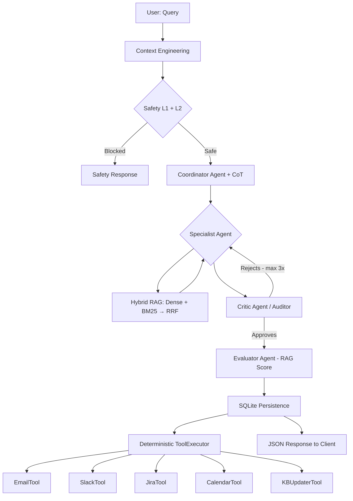

# Multi-Agent RAG System Architecture Report (03-PI)

## 1. Vision of Architecture
The system uses a **Retrieval-Augmented Routing with Hybrid Recovery (RRF), Dual-Layer Safety, and Autonomous Evaluation Architecture**, designed to maximize precision through granular reasoning and iterative quality validation.

### System Flow Diagram

## 2. Key Components

### A. Defense in Depth (Dual-Layer Safety)
- **L1 (Patterns)**: Instant filtering of 25+ forbidden patterns (Prompt Injection, API key requests, etc.).
- **L2 (Semantic)**: The Safety Agent analyzes the deep intent of the query using an LLM to detect sophisticated attacks that bypass text filters.

### B. Hybrid RAG with RRF
Unlike traditional RAG, the system uses **Reciprocal Rank Fusion (RRF)** to combine:
- **Dense Search (ChromaDB)**: Captures semantic meaning.
- **Lexical Search (BM25)**: Ensures exact matches for technical terms and codes.

### C. Audit & Iteration Loop
The **Critic Agent** implements a real recursive loop. If it detects placeholders (`[Name]`), lack of empathy, or incomplete technical data, it returns the response to the **Specialist** with precise feedback. Up to **3 attempts** are allowed to ensure excellence.

### D. Autonomous Evaluation & Observability
- **Evaluator Agent**: Scores each final response based on `accuracy`, `relevance`, and `groundedness`.
- **Traceability**: Full integration with **Langfuse** to monitor costs, stage-by-stage latency, and complete auditor traces.

## 3. Deterministic ToolExecutor
The execution of external actions is not left to LLM chance. The **ToolExecutor** triggers tools based on the structured metadata of the response:
- **Email/Slack/Jira**: Activated by priority (HIGH/CRITICAL).
- **Calendar**: Automatic scheduling if human supervision is required.
- **KB Updater**: If the evaluation score is ≥ 0.7, the case is auto-indexed into the knowledge base.

## 4. Stability and Testing
The system features a suite of **75 E2E tests** that validate everything from safety to RAG fusion logic, ensuring each component works correctly before deployment.

## 5. Conclusion
03-PI evolves from a simple router to a sophisticated agent system that balances technical expertise with centralized, iterative quality control, guaranteeing safe, accurate, and actionable responses.
