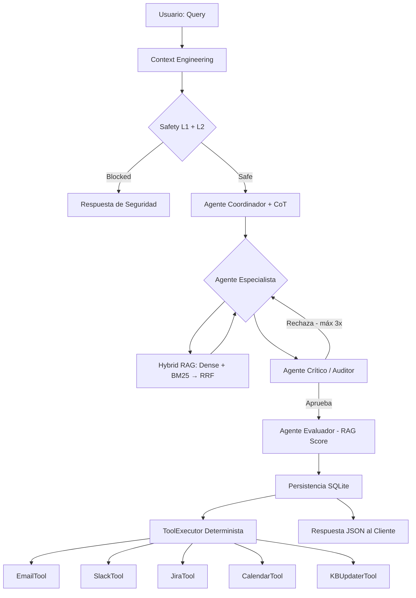

# Reporte de Arquitectura del Sistema RAG Multi-Agente (03-PI)

## 1. Visión de la Arquitectura
El sistema utiliza una **Arquitectura de Ruteo Aumentada con Recuperación Híbrida (RRF), Seguridad Bicapa y Evaluación Autónoma**, diseñada para maximizar la precisión mediante el razonamiento granular y la validación iterativa de calidad.

### Diagrama de Flujo del Sistema

## 2. Componentes Clave

### A. Seguridad en Profundidad (Bicapa)
- **L1 (Patrones)**: Filtrado instantáneo de 25+ patrones prohibidos (Prompt Injection, solicitudes de API keys, etc.).
- **L2 (Semántico)**: El Agente de Seguridad analiza la intención profunda de la consulta usando un LLM para detectar ataques sofisticados que evaden filtros de texto.

### B. RAG Híbrido con RRF
A diferencia del RAG tradicional, el sistema utiliza **Reciprocal Rank Fusion (RRF)** para combinar:
- **Búsqueda Densores (ChromaDB)**: Captura el significado semántico.
- **Búsqueda Léxica (BM25)**: Asegura la coincidencia exacta de términos técnicos y códigos.

### C. Ciclo de Auditoría e Iteración
El **Agente Crítico** implementa un bucle recursivo real. Si detecta placeholders (`[Nombre]`), falta de empatía o datos técnicos incompletos, devuelve la respuesta al **Especialista** con feedback preciso. Se permiten hasta **3 intentos** para garantizar la excelencia.

### D. Evaluación Autónoma y Observabilidad
- **Agente Evaluador**: Califica cada respuesta final en base a precisión (`accuracy`), relevancia (`relevance`) y fundamentación (`groundedness`).
- **Trazabilidad**: Integración total con **Langfuse** para monitorear costos, latencia por etapa y trazas completas del auditor.

## 3. ToolExecutor Determinista
La ejecución de acciones externas no se deja al azar del LLM. El **ToolExecutor** dispara herramientas basándose en la metadata estructurada de la respuesta:
- **Email/Slack/Jira**: Activación por prioridad (ALTA/CRÍTICA).
- **Calendar**: Agendado automático si se requiere supervisión humana.
- **KB Updater**: Si el score de evaluación es ≥ 0.7, el caso se auto-indexa en la base de conocimiento.

## 4. Estabilidad y Testing
El sistema cuenta con una suite de **75 tests E2E** que validan desde la seguridad hasta la lógica de fusión del RAG, asegurando que cada componente funcione correctamente antes del despliegue.

## 5. Conclusión
03-PI evoluciona de un ruteador simple a un sistema de agentes sofisticado que equilibra la especialización técnica con un control de calidad centralizado e iterativo, garantizando respuestas seguras, precisas y accionables.
