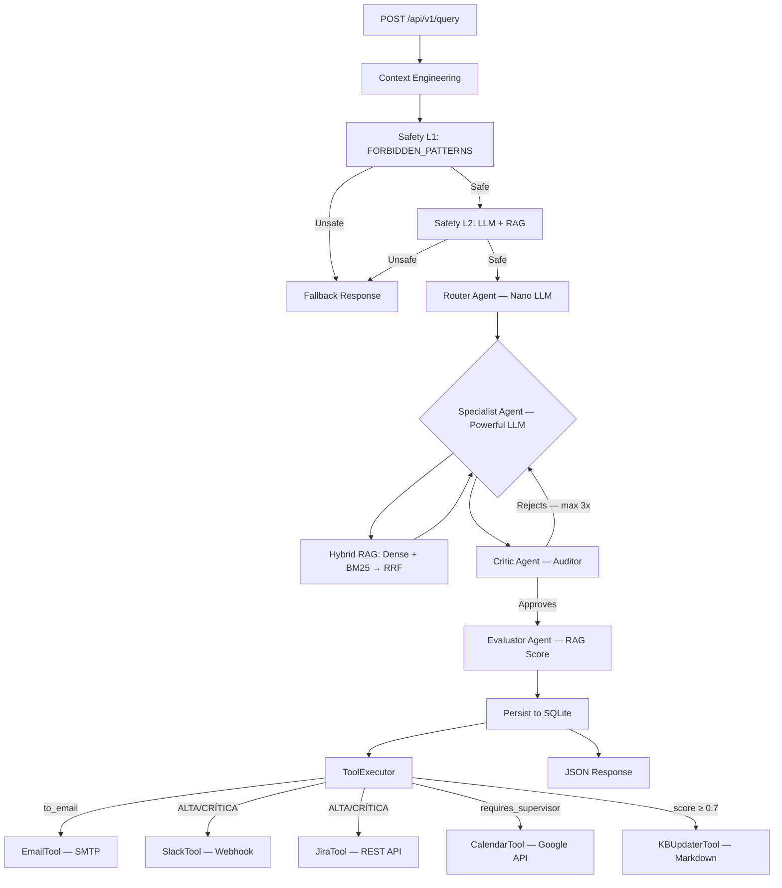

# Arquitectura y Stack Tecnológico — Multi-Agent Routing System (03-PI)

Este documento describe la arquitectura técnica completa y las tecnologías utilizadas en el sistema de ruteo multi-agente, incluyendo las últimas incorporaciones: **Hybrid RAG con RRF**, **sistema de Tools deterministas** y **suite de tests E2E**.

---

## 1. Stack Tecnológico

| Componente | Tecnología | Propósito |
| :--- | :--- | :--- |
| **Framework Web** | FastAPI | API REST asíncrona de alto rendimiento con OpenAPI automático. |
| **Orquestación de IA** | LangChain ≥ 0.3 | Gestión de agentes, cadenas LLM, prompts y parsers Pydantic. |
| **Modelos de Datos** | Pydantic v2 | Validación estricta de entradas/salidas estructuradas de todos los agentes. |
| **Base de Datos Vectorial** | ChromaDB + `langchain-chroma` | Almacenamiento persistente de embeddings por departamento para RAG denso. |
| **Búsqueda Léxica** | BM25 (`rank_bm25`) | Recuperación por palabras clave exactas para complementar la búsqueda semántica. |
| **Fusión Híbrida** | RRF (Reciprocal Rank Fusion) | Combina resultados de búsqueda densa y léxica mediante re-ranking determinista. |
| **Embeddings** | `sentence-transformers` | Generación de vectores semánticos para ChromaDB. |
| **Base de Datos Relacional** | SQLite + SQLAlchemy + aiosqlite | Persistencia asíncrona del historial de consultas, métricas y trazas de auditoría. |
| **Observabilidad** | Langfuse | Trazabilidad completa de ejecuciones, costos, scores y análisis de calidad. |
| **Proveedores de LLM** | OpenAI, Groq, Gemini, VertexAI, LM Studio | Versatilidad en modelos locales y en la nube; intercambiables vía `.env`. |
| **Contenedorización** | Docker + Docker Compose | Entorno de desarrollo y ejecución reproducible y aislado. |
| **Testing** | pytest + pytest-asyncio + httpx | Suite E2E con 75 tests sobre cliente HTTP asíncrono contra DB en memoria. |

---

## 2. Arquitectura de Agentes

El sistema utiliza un patrón de **Orquestación Jerárquica con Bucle de Crítica + Evaluación RAG**:

### A. Capas de Entrada

1. **Context Engineering** (`context_service.py`): Normaliza y hashea la consulta del usuario para mejorar la precisión del ruteo y detectar duplicados.
2. **Safety Guard** (`safety_service.py`): Filtrado en dos capas:
   - **L1**: Detección de patrones adversarios mediante regex/substring en `FORBIDDEN_PATTERNS` (25+ patrones).
   - **L2**: Análisis semántico profundo con el Nano LLM + consulta al RAG para detectar intenciones dañinas no triviales.

### B. Agente Coordinador (Router)

- **Modelo**: Nano LLM (rápido y económico).
- **Razonamiento**: Chain-of-Thought (CoT) estructurado en 4 pasos.
- **Salida**: `RouterResponse` — intención, confianza y razón de clasificación.
- **Departamentos**: `RRHH`, `TECNOLOGIA`, `FINANZAS`, `RECLAMOS`, `GENERAL`.

### C. Agentes Especialistas (Specialists)

- **Modelo**: Powerful LLM (alta capacidad).
- **Contexto enriquecido**: reciben consulta + contexto RAG + rol + tono + feedback del Crítico.
- **Salida**: `SpecialistResponse` — respuesta, próximos pasos, prioridad (`BAJA/MEDIA/ALTA/CRÍTICA`), `requires_supervisor`.

### D. Agente Crítico (Auditor)

- Valida: completitud, tono, ausencia de placeholders, precisión técnica.
- Si rechaza → genera `suggestions` y relanza al Especialista (máximo **3 intentos**).
- **Salida**: `CriticResponse` — `is_valid`, `issues`, `suggestions`, `score`.

### E. Agente Evaluador (RAG Evaluator)

- Califica la respuesta final en 3 dimensiones: `accuracy`, `relevance`, `groundedness`.
- Alimenta Langfuse con un `final_score` (0.0–10.0).
- El score se utiliza como gate para el **KB Updater Tool**.

---

## 3. Sistema de Tools Deterministas

La capa de herramientas es **desacoplada del LLM**: la decisión de qué tools ejecutar la toma el `ToolExecutor` en base a la metadata de la respuesta del especialista, no mediante function calling.

### Herramientas disponibles

| Tool | Activación | Integración |
| :--- | :--- | :--- |
| `EmailTool` | `to_email` presente | SMTP (Gmail/Outlook) con template HTML |
| `SlackTool` | `priority ∈ {ALTA, CRÍTICA}` o `requires_supervisor` | Incoming Webhooks + Slack Block Kit |
| `JiraTool` | `priority ∈ {ALTA, CRÍTICA}` o `requires_supervisor` | Jira REST API v3 con prioridad mapeada |
| `CalendarTool` | `requires_supervisor = true` | Google Calendar API v3 — agenda reunión de escalación |
| `KBUpdaterTool` | `evaluation_score ≥ 0.7` | Escribe caso resuelto como `.md` en la KB del departamento |

### Lógica del ToolExecutor

```
ALWAYS:   EmailTool    ← if to_email is provided
IF:       priority in (ALTA, CRÍTICA) OR requires_supervisor → SlackTool + JiraTool
IF:       requires_supervisor → CalendarTool
IF:       evaluation_score ≥ 0.7 → KBUpdaterTool
```

> **Modo Dry-Run**: configurado con `DRY_RUN=true` en `.env`. Las herramientas loguean el payload sin ejecutar llamadas externas reales. Ideal para desarrollo y tests.

---

## 4. Implementación de RAG Híbrido

El `RAGManager` segmenta la base de conocimiento por departamento y aplica **Reciprocal Rank Fusion (RRF)** mediante la clase `HybridRetriever`:

```
query
  ├─── ChromaDB (Semántico)  → ranked list A (por similitud vectorial)
  └─── BM25     (Léxico)     → ranked list B (por frecuencia de términos)
           ↓
       RRF fusion:  score(d) = Σ weight_i / (k + rank_i(d))
           ↓
       Top-K documentos re-rankeados por relevancia combinada
```

- **Pesos**: 70% semántico / 30% léxico (configurable).
- **Constante RRF (k)**: 60 (estándar de la literatura).
- **Deduplicación**: documentos compartidos entre listas se fusionan, no duplican.
- **Formatos soportados**: Markdown (`.md`), texto plano (`.txt`), PDF (`.pdf`).

---

## 5. Flujo Completo del Sistema



---

## 6. Observabilidad y Métricas

Cada ejecución genera un payload enriquecido persistido en SQLite y trazado en Langfuse:

| Campo | Descripción |
| :--- | :--- |
| `latency_ms` | Tiempo total: Router + (Especialista × intentos) + Auditor + Evaluador |
| `total_tokens` | Tokens acumulados de todos los agentes en todos los intentos |
| `estimated_cost_usd` | Costo simulado en base a precios GPT-4o (configurable) |
| `evaluation_score` | Score 0.0–10.0 del Evaluador RAG (accuracy + relevance + groundedness) |
| `audit_trace` | Lista de objetos `CriticResponse` de cada intento de refinamiento |
| `attempts` | Número real de ciclos Especialista ↔ Auditor ejecutados |
| `context_hash` | Hash SHA del contexto para detección de consultas repetidas |

---

## 7. Testing

Suite de **75 tests** que corren íntegramente en Docker con SQLite in-memory y sin credenciales reales:

| Módulo | Tests | Cobertura |
| :--- | :--- | :--- |
| `test_core.py` | 3 | Modelos Pydantic + SafetyGuard base |
| `test_tools.py` | 8 | Todas las tools dry-run + ToolExecutor |
| `test_e2e_query.py` | 10 | Endpoint `/query`, historial, paginación, detalle, 404 |
| `test_e2e_safety.py` | 8 | L1 patterns, case-insensitive, API block, persistencia |
| `test_e2e_rag.py` | 9 | RRF, deduplicación, pesos, RAGManager por departamento |
| `test_e2e_tools.py` | 15 | Tools individuales + ToolExecutor × prioridad + E2E API |
| `test_e2e_resources.py` | 5 | Root, prompts, knowledge, docs, openapi |
| `test_prompts.py` | 2 | Sintaxis y variables de templates de prompts |
| `test_init.py` | 15 | Tests de inicialización del sistema |

```bash
# Ejecutar la suite completa dentro del contenedor
docker exec multi_agent_routing_api python -m pytest tests/ -v
```

---

## 8. Estructura del Proyecto

```
.
├── main.py                         # Entrypoint FastAPI (lifespan, middleware, router)
├── requirements.txt                # Dependencias declarativas
├── docker-compose.yml              # Orquestación de contenedores
├── .env.example                    # Template de variables de entorno
├── prompts/                        # Templates Markdown de prompts por agente
├── data/                           # Bases de conocimiento por departamento (RAG)
│   ├── rrhh/
│   ├── tecnologia/
│   ├── finanzas/
│   ├── reclamos/
│   └── general/
├── src/
│   ├── api/v1/
│   │   └── endpoints/
│   │       ├── query.py            # POST /query, GET /history, GET /query/{id}
│   │       └── resources.py        # GET /prompts, GET /knowledge
│   ├── core/
│   │   ├── config.py               # Configuración centralizada desde .env
│   │   ├── constants.py            # FORBIDDEN_PATTERNS, AGENT_ROLES, VALID_DEPARTMENTS
│   │   └── exceptions.py           # Manejo de errores HTTP
│   ├── database/
│   │   └── session.py              # Engine + Base SQLAlchemy async
│   ├── repositories/
│   │   └── query_repository.py     # CRUD asíncrono de consultas
│   ├── schemas/
│   │   └── query_schemas.py        # QueryRequest, QueryResponse, DetailedQueryResponse
│   └── services/
│       ├── routing_service.py      # Orquestador principal del flujo multi-agente
│       ├── resource_service.py     # Acceso a prompts y knowledge base
│       ├── ai/
│       │   ├── agent_service.py    # Router, Specialist, Critic, Evaluator agents
│       │   ├── rag_service.py      # HybridRetriever (RRF) + RAGManager
│       │   └── context_service.py  # Normalización y hashing de contexto
│       ├── security/
│       │   └── safety_service.py   # SafetyGuard L1 + L2
│       └── tools/
│           ├── base_tool.py        # BaseTool ABC + ToolResult dataclass
│           ├── tool_executor.py    # Decisor determinista de tools
│           ├── jira_tool.py        # Jira REST API v3
│           ├── email_tool.py       # SMTP + HTML template
│           ├── slack_tool.py       # Incoming Webhooks + Block Kit
│           ├── calendar_tool.py    # Google Calendar API v3
│           └── kb_updater_tool.py  # Escritura en KB local (Markdown)
└── tests/
    ├── conftest.py                 # Fixtures: DB in-memory, mocked agents, client
    ├── test_core.py
    ├── test_tools.py
    ├── test_prompts.py
    ├── test_e2e_query.py
    ├── test_e2e_safety.py
    ├── test_e2e_rag.py
    ├── test_e2e_tools.py
    └── test_e2e_resources.py
```
